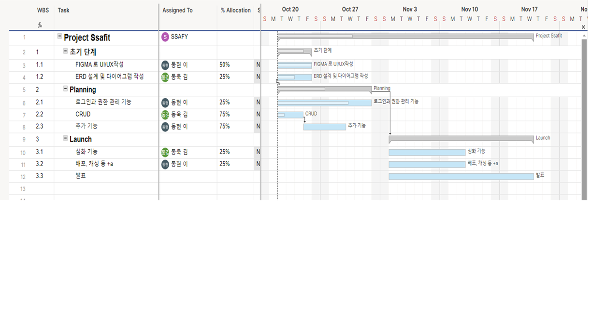

# 운동 영상 및 리뷰 사이트 SSAFIT
## 1.프로젝트 소개

 
## 2. 작업 순서
### 2-1 WBS 

### 2-2 FIGMA

### 2-3 ERD DIAGRAM

## 3. 팀 소개
<table>
    <tr align="center">
        <td></td>
        <td></td>
        <td></td>
    </tr>
    <tr align="center">
        <td>이동현</td>
        <td>김동욱</td>
    </tr>
    <tr align="center">
        <td>Full stack, Devops</td>
        <td>Full stack</td>
    </tr>
</table>
 

## 4. 팀원간 규약
1. 약속 생기면 바로 말하기
2. 쉽게 생각하지말고 완성하고 말하기

3. DB 네이밍 규칙 
   3-1. 테이블, 칼럼 명을 소문자로만 작성한다. 운영체제에 따라 다르기 때문이다.  
   3-2. SNAKE CASE를 사용한다.  ex) first_Name(X), first_name(O) 
   3-3. 축약어를 사용하지 않는다. ex)fst_name (x) first_name(o) 
## 5. 서비스 구조도

## 6. 사용방법
# 프로젝트명

## 개요
이 프로젝트는 Java와 Mysql를 사용하여 개발되었습니다.

## 환경 설정
- Node.js v20.11.1(LTS) 설치
