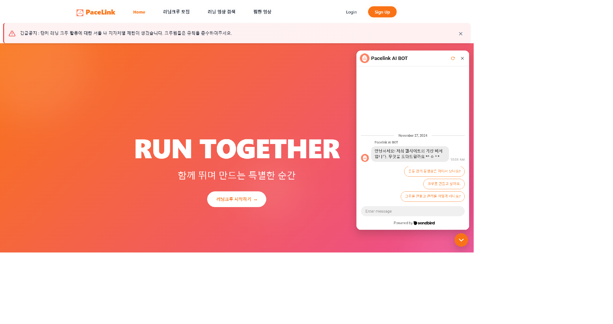
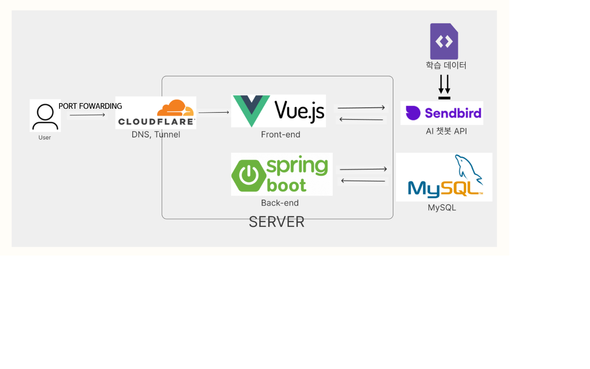

# 운동 영상 및 리뷰 사이트 SSAFIT
## 1.프로젝트 소개

# 🏃‍♂️ 운동 메이트: 함께하는 건강한 라이프 💪  

운동을 좋아하는 사람들을 위한 플랫폼!  
**유튜브 추천 운동 영상**부터 **러닝 크루 모집**, **실시간 그룹 채팅**까지 한 번에!  

## ✨ 주요 기능  

### ✅ 운동 영상 추천 & 찜하기  
- 유튜브에서 추천하는 다양한 운동 영상을 확인하고,  
  마음에 드는 영상을 저장할 수 있어요!  

### ✅ 러닝 크루 모집 게시판  
- 새로운 러닝 메이트를 찾고 싶다면?  
- 원하는 지역과 조건에 맞춰 크루를 모집하고 함께 달려보세요!  

### ✅ 실시간 그룹 채팅  
- 운동 크루들과 실시간으로 소통하며 정보를 공유해 보세요!  
- 채팅을 통해 운동 팁도 얻고, 함께 목표를 달성하세요!  

🚀 **운동을 더 즐겁고, 함께할 수 있도록!**  
지금 바로 시작해보세요! 💙  

 

 
## 2. 작업 순서
### 2-1 WBS 

### 2-2 FIGMA

### 2-3 ERD DIAGRAM

## 3. 팀 소개
<table>
    <tr align="center">
        <td></td>
        <td></td>
        <td></td>
    </tr>
    <tr align="center">
        <td>이동현</td>
        <td>김동욱</td>
    </tr>
    <tr align="center">
        <td>Full stack, Devops</td>
        <td>Full stack</td>
    </tr>
</table>
 

## 4. 팀원간 규약
1. 약속 생기면 바로 말하기
2. 쉽게 생각하지말고 완성하고 말하기

3. DB 네이밍 규칙 
   3-1. 테이블, 칼럼 명을 소문자로만 작성한다. 운영체제에 따라 다르기 때문이다.  
   3-2. SNAKE CASE를 사용한다.  ex) first_Name(X), first_name(O) 
   3-3. 축약어를 사용하지 않는다. ex)fst_name (x) first_name(o) 

4. 그 외 규칙 
  4-1. 협업이므로 남의 코드 의도를 바로 보고 파악하기 힘들 수 있다. 주석을 꼭 자세히 많이 달자. 
## 5. 서비스 구조도

## 6. 사용방법
# 프로젝트명
www.ssafit.store 로 프로젝트 당시 배포까지 진행했습니다.
## 개요
이 프로젝트는 Java와 Mysql를 사용하여 개발되었습니다.

## 환경 설정
- Node.js v20.11.1(LTS) 설치
